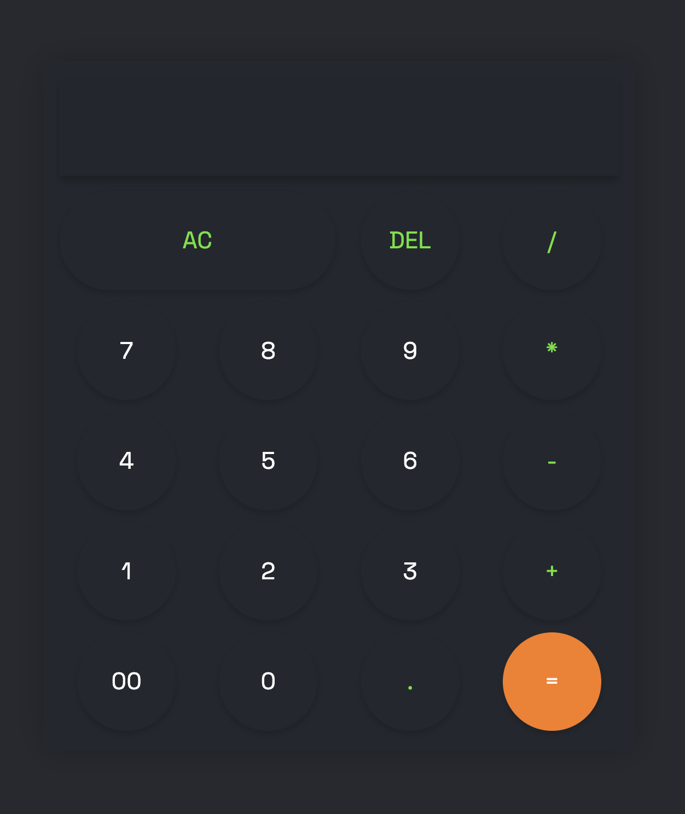

# 🧮 Calculator

A clean and responsive calculator built using **HTML**, **CSS**, and **JavaScript**.  
It performs basic arithmetic operations and features a simple interface that mimics a modern handheld calculator.

---

## 🌐 Tech Stack
- **HTML** — Structure of the calculator UI  
- **CSS** — Layout, styling, and responsiveness  
- **JavaScript** — Button functionality and calculation logic  

---

## ✨ Features
- Supports **addition**, **subtraction**, **multiplication**, and **division**  
- **AC (All Clear)** button resets the entire input  
- **DEL (Delete)** button removes the last character  
- Works with **decimal values**  
- Includes **00** input button  
- Responsive and minimalistic UI  
- Pure vanilla JS — no libraries  

---

## Screenshot


---

## 🚀 How to Run
1. Download or clone the repository:
   ```bash
   git clone https://github.com/your-username/JS-Calculator.git
   ```
2. Open

   index.html
